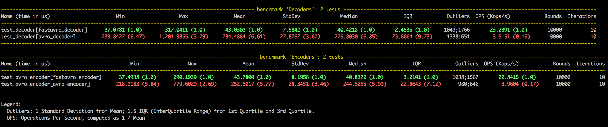

# Benchmarking avro in python 3

------------------------------------

Comparing 2 common [Apache Avro](https://avro.apache.org/) implementations in python 3: 
- [fastavro](https://github.com/fastavro/fastavro) 
- [avro-python3](https://pypi.org/project/avro-python3/)

Current tests have been done on py37 and py38 interpreters, maybe more would be tested later. 

*I share the benchmarking raw results under [reports](reports).*

