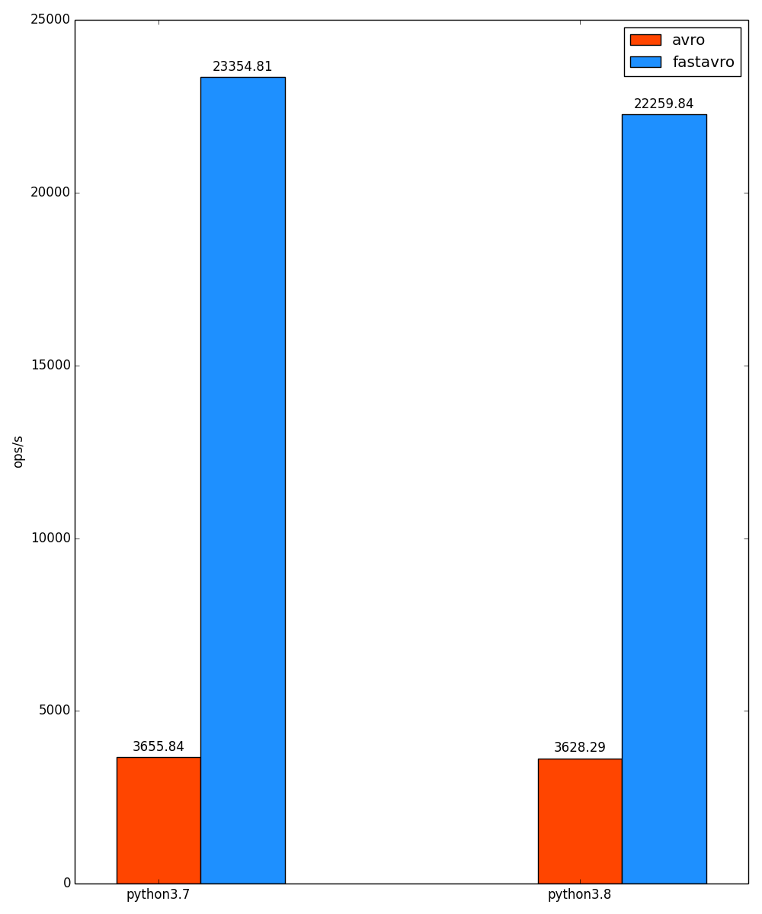

# Benchmarking avro in python 3

------------------------------------

Comparing 2 common [Apache Avro](https://avro.apache.org/) implementations in python 3: 
- [fastavro](https://github.com/fastavro/fastavro) 
- [avro-python3](https://pypi.org/project/avro-python3/)

Tests have been done with python3.7 and python3.8 interpreters, maybe more would be tested later. 

What is really relevent for us in the tables above, is the number of operations performed per unit of time (kops/s). The 2 plots below show the performace of the 2 libraries with different python versions:

  Encoders Benchmark       |  Decoders Benchmark
:-------------------------:|:-------------------------:
  |  

*I share the benchmarking raw results under [reports](reports).*